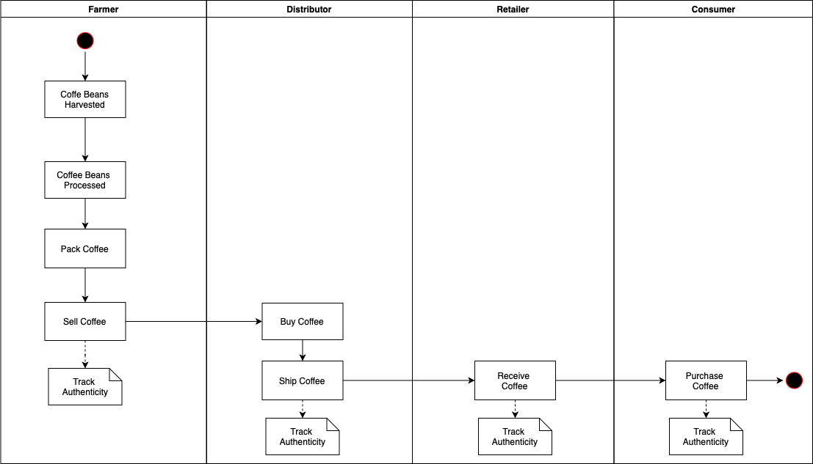
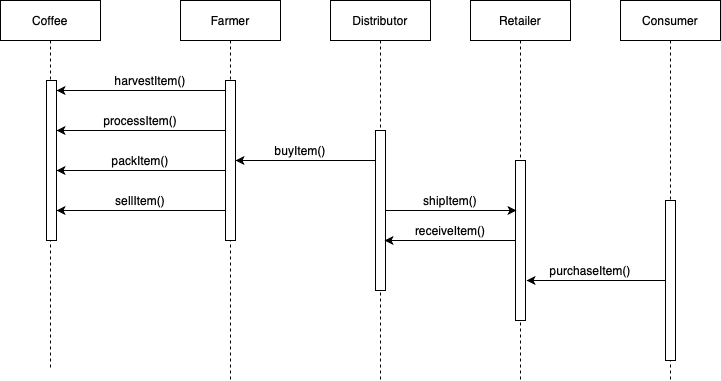
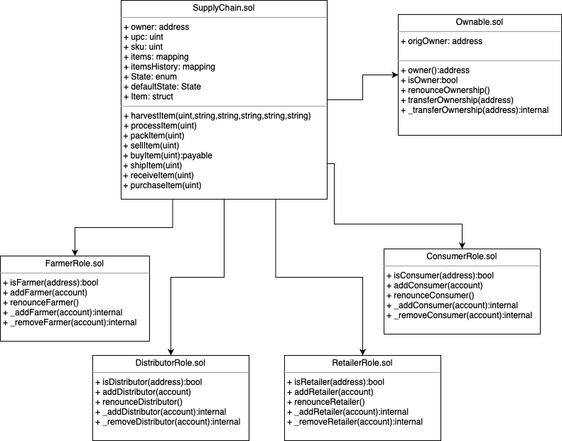

# Supply chain & data auditing
Ethereum DApp that demonstrates a Supply Chain flow between a Seller and Buyer.

## Versions
Truffle v4.1.14 (core: 4.1.14)
Solidity v0.4.24 (solc-js)
node: '12.19.0'
Web3 ^1.2.0

## Transaction on Rinkeby Network 
https://rinkeby.etherscan.io/address/0xce213450c84a21800672cc7985b2053f9b1096e5

## Activity Diagram 

## Sequence Diagram 

## Class Diagram 

